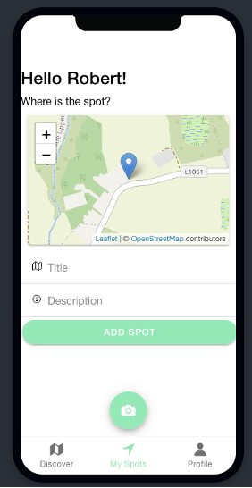
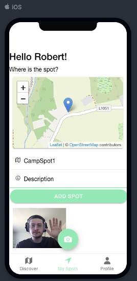

## Adventurer's Atlas

**Geolocation Camping App built with React and Ionic**

Adventurer's Atlas is a Camping app allowing users to share their camping spots with the camping community.  
Users can click onto any spot on the map (powered by *OpenStreetMap*) and be redirected to GoogleMaps for directions to the camping spot they want to go to.  
The app also features weather API provided by *OpnenWeather* that refreshes every 10 minutes.  

Users can upload their own camping spots along with details and attach a photo of the spot which gets uploaded to the DjangoAPI.

