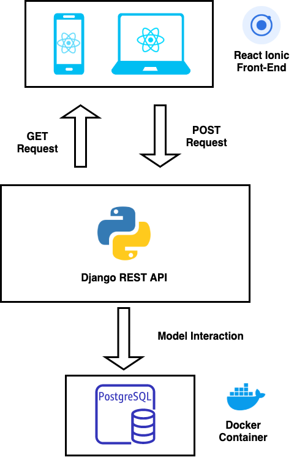
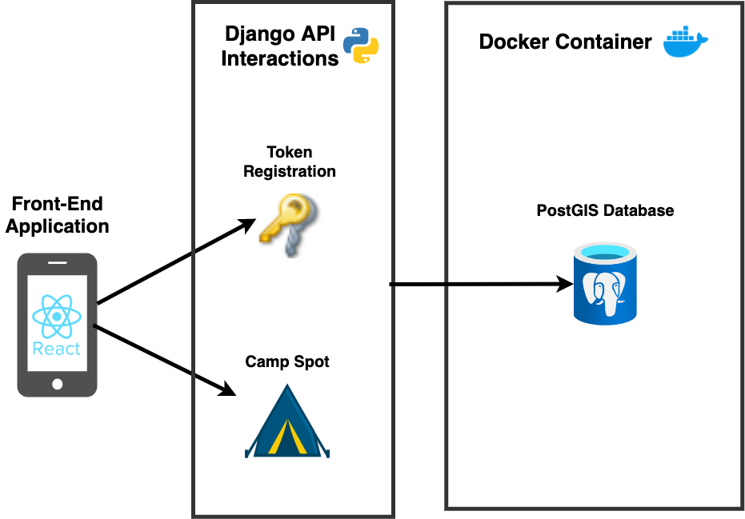

# Adventurer's Atlas - Overview

## Technical Diagram

The following project has 3 Tier Architecture.  
* Front end of the project has been done using React and Ionic
* Middle tier is a Django API which serves camping spot information to the front end and commits this info into the backend
* Backend is a postGIS database containing geolocation data as well as user information  



## Camping Discovery

Adventurer's Atlas is a Camping app allowing users to share their camping spots with the camping community.  
Users can click onto any spot on the map (powered by *OpenStreetMap*) and be redirected to GoogleMaps for directions to the camping spot they want to go to.  
The app also features weather API provided by *OpnenWeather* that refreshes every 10 minutes.  

```JavaScript
 React.useEffect(() => {
      ...
      ...
      setInterval(() => {
        getWeather(position.coords.latitude, position.coords.longitude).then(
          (weather) => {
            setWeather(weather);
            console.log("10 min Weather: " + weather);
          }
        );
      }, 600000);
    });
    ...
    ...
  }, []);
```

**Discover Page**
<div>


</div>

## Adding Spots
Users can upload their own camping spots along with the spot details. They can also attach a photo or take it using the device's camera.
  
The asynchronous addSpot function uploads the data and image as a form to the API

```JavaScript
export const addSpot = async (formData) => {
  try {
    const res = new XMLHttpRequest();
    res.open("POST", `${process.env.REACT_APP_API_URL}/spot/`, true);
    res.send(formData);
    return 200;
  } catch (error) {
  ...
  ...
  }
};
```

**Uploading Spot Demonstration**
<div>


</div>

## Users and Authentication

The app is using JSON Web Token (JWT) authentication provided by the Django API and stores the token locally on the device.  
Using Axios, the token is sent to the API to be verified and the payload will be updated with the user information.  
The payload is used to display the user's information within the app such as their name or email address.

```JavaScript
export const checkAuthenticated = () => async (dispatch) => {
  if (localStorage.getItem("access")) {
    const config = {
      headers: {
        "Content-Type": "application/json",
        Accept: "application/json",
      },
    };

    const body = JSON.stringify({ token: localStorage.getItem("access") });

    try {
      const res = await axios.post(
        `${process.env.REACT_APP_API_URL}/auth/jwt/verify/`,
        body,
        config
      )
      ...
      ...
```


**Login and Registration Screens** 
<div>


</div>

