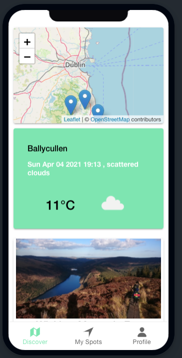

# Adventurer's Atlas - Overview

## Geolocation Camping App built with React and Ionic

Adventurer's Atlas is a Camping app allowing users to share their camping spots with the camping community.  
Users can click onto any spot on the map (powered by *OpenStreetMap*) and be redirected to GoogleMaps for directions to the camping spot they want to go to.  
The app also features weather API provided by *OpnenWeather* that refreshes every 10 minutes.  

```JavaScript
 React.useEffect(() => {
      ...
      ...
      setInterval(() => {
        getWeather(position.coords.latitude, position.coords.longitude).then(
          (weather) => {
            setWeather(weather);
            console.log("10 min Weather: " + weather);
          }
        );
      }, 600000);
    });
    ...
    ...
  }, []);
```

<div>


</div>

## Adding Spots
Users can upload their own camping spots along with the spot details. They can also attach a photo or take it using the device's camera.
  
The asynchronous addSpot function uploads the data and image as a form to the API

```JavaScript
export const addSpot = async (formData) => {
  try {
    const res = new XMLHttpRequest();
    res.open("POST", `${process.env.REACT_APP_API_URL}/spot/`, true);
    res.send(formData);
    return 200;
  } catch (error) {
  ...
  ...
  }
};
```


<div>


</div>

## Users and Authentication

The app is using JSON Web Token (JWT) authentication provided by the Django API and stores the token locally on the device.

<div>


</div>
